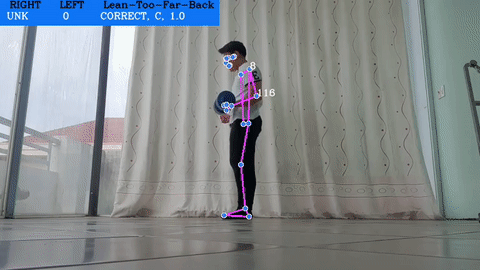
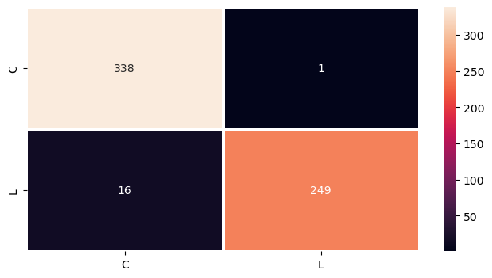
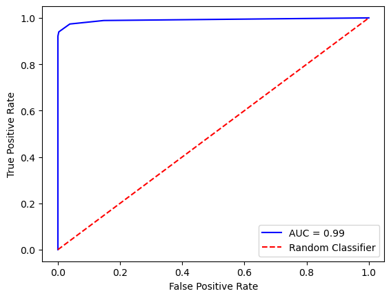
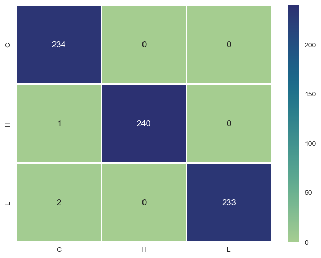
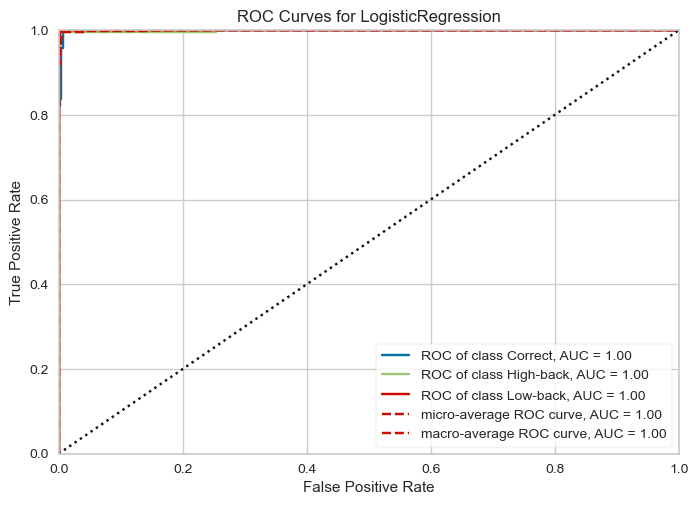

<div id="top"></div>

<!-- PROJECT LOGO -->
<br />
<div align="center">
    <a href="https://github.com/laizhenyoong/Form_Correction_With_Pose_Estimation.git">
        
    </a>
s
  <h2 align="center">Exercise Pose Correction</h2>

  <p align="center">
    Make use of the power of Mediapipe’s pose detection, this project is built in order to analyze, detect and classifying the forms of fitness exercises.
  </p>
</div>

<!-- ABOUT THE PROJECT -->

## About The Project

This project goal is to develop 4 machine learning models for 4 of the most home exercises **(Bicep Curl, Plank, Squat and Lunge)** which each model can detect any form of incorrect movement while a person is performing a correspond exercise. In addition, a web application that utilize the trained models, will be built in other to analyze and provide feedbacks on workout videos.

Here are some detections of the exercises:

-   Bicep Curl
<p align="center"></p>

-   Basic Plank
<p align="center"></p>

-   Models' evaluation results and website screenshots [here](#usage)

<p align="right">(<a href="#top">back to top</a>)</p>

### Built With

1. For data processing and model training

    - [Numpy](https://numpy.org/)s
    - [Pandas](https://pandas.pydata.org/)
    - [Sklearn](https://scikit-learn.org/stable/)
    - [Keras](https://keras.io/)

<p align="right">(<a href="#top">back to top</a>)</p>

## Dataset

Due to the lack of videos or dataset online that recorded human doing exercises both in a proper or improper way, the majority of self-collected videos were either recorded by myself, my friends or my family. The majority of the collected videos were removed due to privacy purpose.

With an exercise such as Plank, as there is not much movement during the exercise, I’m able to find a dataset from an open database from [Kaggle](https://www.kaggle.com/datasets/niharika41298/yoga-poses-dataset). The found dataset is about many yoga poses but the very well-known ones are the downward dog pose, goddess pose, tree pose, plank pose and the warrior pose. The dataset contains 5 folders for 5 poses, each folder contains images of people correctly doing the correspond pose.

For the purpose of this thesis, only the folder contains the images of people properly doing plank is chosen. There are 266 image files in that folder, I handpicked all the images that represent a basic plank and discard the reset. In conclusion, there are 30 images which are arranged to the proper form class for basic plank.

## Getting Started

This is an example of how you may give instructions on setting up the project locally.

#### Setting Up Environment

```
    Python 3.8.13
    Node 17.8.0
    NPM 8.5.5
    OS: Linux or MacOS
```

```markdown
    NOTES
    ⚠️ Commands/Scripts for this project are wrote for Linux-based OS. They may not work on Windows machines.
```

### Installation

_If you only want to try the website, look [here](./web/README.md)._

1. Clone the repo and change directory to that folder

    ```sh
    git clone https://github.com/NgoQuocBao1010/Exercise-Correction.git
    ```

1. Install all project dependencies

    ```bash
    pip install -r requirements.txt
    ```

1. Folder **_[core](./core/README.md)_** is the code for data processing and model training.s

<p align="right">(<a href="#top">back to top</a>)</p>

<!-- USAGE EXAMPLES -->
<div id="Usage"></div>
<br/>

## Usage

As the introduction indicated, there are 2 purposes for this project.

1. Model training **(describe in depth [here](core/README.md))**. Below are the evaluation results for each models.

    - [Bicep Curl](core/bicep_model/README.md) - _lean back error_: Confusion Matrix - ROC curve
      |  |  |
      | ------------- | ------------- |
    - [Plank](core/plank_model/README.md) - _all errors_: Confusion Matrix - ROC curve
      |  |  |
      | ------------- | ------------- |s
s
<p align="right">(<a href="#top">back to top</a>)</p>ssss

<p align="right">(<a href="#top">back to top</a>)</p>

<!-- ACKNOWLEDGMENTS -->

## Acknowledgments

-   Here are some other projects which I get inspired from: [Pose Trainer](https://github.com/stevenzchen/pose-trainer), [Deep Learning Fitness Exercise Correction Keras](https://github.com/Vollkorn01/Deep-Learning-Fitness-Exercise-Correction-Keras) and [Posture](https://github.com/twixupmysleeve/Posture).
-   [Logo marker](https://www4.flamingtext.com/) for this project.
-   This awesome README template is from [Best README Template](https://github.com/othneildrew/Best-README-Template). ♥

<p align="right">(<a href="#top">back to top</a>)</p>
